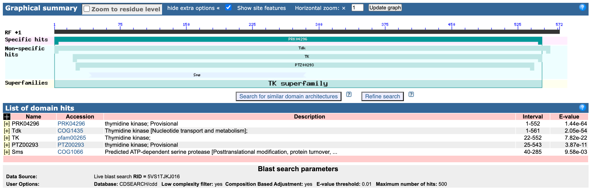

[Click here for a guide to Markdown format](https://www.markdownguide.org/cheat-sheet/)

# Sequence ID Exercise

## The sequence

```
ATGGCACAATTATTTTTTAAATATGGCGCAATGAACAGTGGGAAAACAATTGAAATTTTGAAAGTTGCCC
ACAATTATGAAGAGCAAGATAAACCTGTTGTGATTATGACAAGTGGTTTAGATACGCGTTCTGGAGTAGG
GCGAGTCTCAAGTCGAATCGGATTGGAAAGAGAAGCATTGCCGATTTTTGCTGAAACTAACGATTTTGAA
ACGATTGTAAATTTAGAATTAAAACCCTACTGTGTGCTAATCGACGAAGCACAATTTTTGCAAAAACAGC
ATGTTTTGGACTTTACTAGAATTGTAGATGAATTGAATATTCCAGTAATGGCCTTTGGCTTAAAAAATGA
TTTTCGCAATGAGTTATTTGAAGGATCTAAATATTTACTTTTATATGCTGACAAAATTGAAGAAATGAAA
ACAATCTGTTGGTTTTGTCATAAAAAAGCGATTATGAACCTTCATTATATTGATGGAAAACCAGTCTATG
AAGGAAACCAAGTCCAAATTGGGGGCAACGAAGCGTATTATCCTGTGTGCCGACACCATTATTTCCATCC
AGAAATATAA
```

## BLAST

Using BLAST

* Determine what protein/gene the sequence has homology to.
* Identify the organism the sequence is likely to have come from.
* Determine the taxonomic order of the organism.

First, performed a BLASTx

* Search accession: 5VS1TEYN016
* [Hit table](./5VS1TEYN016-Alignment.txt)
* Parameters:
	* database: nr
	* e-value: 0.05
	* word size: 6
	* scoring matrix: BLOSUM62
	* genetic code: standard

The BLASTx search also searched the CDD

* Parameters:
	* Database: CDSEARCH/cdd   
	* Low complexity filter: yes  
	* Composition Based Adjustment: yes  
	* E-value threshold: 0.01   
	* Maximum number of hits: 500
* Results:



Next, performed a BLASTn to confirm organism identity

* Search accession: 5VTKN45E013 
* [Hit table](./5VTKN45E013-Alignment)
* Parameters:
	* database: nr
	* organism: Enterococcus (taxid:1350)
	* e-value: 0.05
	* word size: 28
	* match/mismatch: 1,-2
	* gap costs: linear

### Answers

**Protein/Gene:** Thymidine kinase

Evidence:

* Top 100 hits from blastx were thymidine kinase
* Sequence hit thymidine kinase profiles in the CDD

**Organism:** Enterococcus saigonensis VE80

Evidence:

* Top hit from blastx was Enterococcus saigonensis
* Top hit from blastn was Enterococcus saigonensis VE80 
	* e-value=0, query cover=100%

**Taxonomic order:** Lactobacillales

* [Taxonomy info](https://www.ncbi.nlm.nih.gov/Taxonomy/Browser/wwwtax.cgi?id=1805431)
* Tax id: 186826


## UniProt

**Find the entry for the protein (in the organism) you identified in #3**

The search term `thymidine kinase organism:"enterococcus saigonensis"` returned a single hit: [A0A679I946](https://www.uniprot.org/uniprot/A0A679I946)

**Build a query that will find this protein in all members of the taxonomic order that the organism belongs to**

`thymidine kinase taxonomy:"Lactobacillales [186826]"` returns 1,744 results, 22 of which are reviewed (SwissProt)

**Search for all proteins in the organism of interest**

`organism:"enterococcus saigonensis"` returns 2,689 results.

Fasta sequences for the results are [here](./uniprot-organism__enterococcus+saigonensis_)

